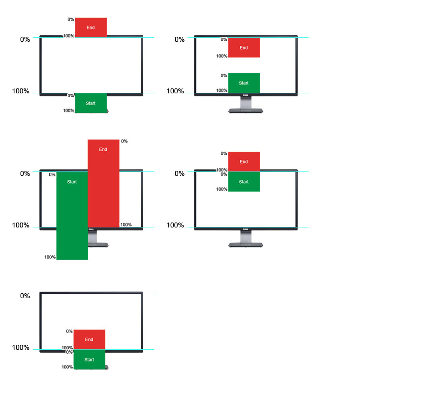

RenderFarm v3
==============================
It has been determined that there are 6 conditions for start positions and end positions from which elements can animate from and to.

DOM elements heights are looked at in percentages. Each DOM element is 100% tall.

The screen is also seen as a percentage. No matter the window size, it is considered 100% tall. With that in mind, the "TOP" is 0% and the "BOTTOM" is 100%.

The 6 Element Positions
---
Each element you target will have a point which activates it, and another point which deactivates it. They are described as: Activate/Deactivate when `what percentage of the element's height` is `less than what percentage of the screen's height`.

 1. Activate when 0% is at 100%, deactivate when 100% is at 0%.
 2. Activate when 100% is at 100%, deactivate when 0% is at 0%.
 3. Activate when 0% is at 0%, deactivate when 100% is at 100%.
 4. Activate when 0% is at 0%, deactivate when 100% is at 0%.
 5. Activate when 0% is at 100%, deactivate when 100% is at 100%.
 6. Activate when x% is at x%, deactivate when x% is at x%

This needs some labeling, but gives you the idea. #6 is from anywhere to anywhere.

Here is how you use it.
--

The long form configuration looks like this.

    $('#selector').piggy({
		start: {
			when: "0%",
			is: "100%",
			vals: {
				x: 0
			},
			call: function(){
			}
		},
		end: {
			when: "100%",
			at: "0%",
			vals: {
				x: 50
			},
			call: function(offtop){
			}
		},
		scroll: function(vals){
		}
    });

Select your element. specify the points that activate/deactivate, values to track from place to place, and which tracking method you want to use.

#### activate ####
`start` is triggered when the element is less than the first boundary

#### deactivate ####
`end` is triggered when the element is scrolled back below the first boundary or above the second boundary. A boolean is passed to indicate if the element has been scrolled off the top of the boundary.

#### scroll ####
`scroll` is triggered when the element is on the screen and the user scrolls. An object is passed as an argument to the `scroll` method containing any properties you've specified inside of `start.vals` and `end.vals` as calculated to the  proportion of the distance between their values depending on the percentage of where your element is between the `start` and `end` values.

When the element is exactly centered on the screen, offset is 0.

When the element is completely below the screen, offset is -1

When the element is completely above the screen, offset is 1.

#### render ####
`render` is triggered when the element is on the screen using requestAnimationFrame. A value between -1 and 1 is passed to indicate how much of the element is on the screen.

When the element is exactly centered on the screen, offset is 0

When the element is completely below the screen, offset is -1

When the element is completely above the screen, offset is 1.

There is a demo included showing how to control a Greensock TimelineLite animation with this new implementation. Everything else should be easy to figure out for yourself.

Enjoy animating everything!

UPDATE
#### inside or outside ####
You can pass a boolean as a second parameter to the piggy function to tell RenderFarm if you want to track the element ONLY when it is fully inside the window.

TODO
need to recalculate some stuff when you resize, but that shouldn't be too hard.

